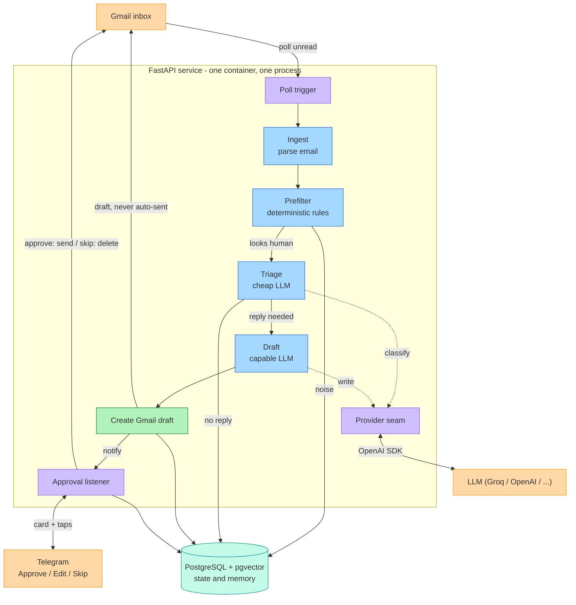

# 02 — Architecture

## Architecture diagram

Renders on GitHub. (Colors: orange = external, blue = pipeline stage, purple =
in-process machinery, green = output, teal = datastore.)



## Shape of the system

The agent is a **linear pipeline of swappable stages**, hosted inside a **single
FastAPI service** (one Uvicorn process), backed by a **PostgreSQL database (with
pgvector)**, and
talking to its language model through **one thin provider seam**. It is packaged
as a **Docker container** so the laptop build and the deployed build are the same
artifact.

Two framework distinctions matter, and they don't conflict:
- It is deliberately *not* built on an **agent-orchestration** framework. The
  pipeline looks like a graph but mechanically it is a sequence of function calls
  with one branch and a state table — a `for` loop with early returns.
- It *is* built as a **FastAPI web service** — not to orchestrate the agent, but
  to give it a standard, deployable shape from day one (background poller now,
  webhook endpoints once deployed). See
  [Decision: FastAPI shell, no agent framework](#decision-fastapi-shell-no-agent-framework)
  below.

## The pipeline

```
Trigger  →  Ingest  →  Prefilter  →  Triage  →  Draft  →  (Approval)  →  (Send)
 (poll)    (parse)    (rules)      (cheap LLM) (capable LLM)  Phase 2     Phase 2
                          │            │
                          └─ skip ─────┴──────────────► record + stop
                          (any stage error) ──────────► needs_attention
```

Reduced to code, the core loop is:

```python
for msg in trigger.new_messages():           # poll Gmail for unread
    if state.already_processed(msg.id):       # idempotency
        continue
    email = ingest.parse(msg)                 # body + metadata, no quote-stripping
    if prefilter.should_skip(email):          # deterministic rules, no LLM
        state.record_skip(email, reason="prefilter"); continue
    decision = triage.classify(email)         # cheap LLM → validated JSON
    if not decision.should_reply:
        state.record_skip(email, decision.reason); continue
    thread = gmail.fetch_thread(email.thread_id)
    draft  = draft.write(email, thread, memory)   # capable LLM, in the owner's voice
    draft_id = gmail.create_draft(draft)
    state.record_drafted(email, draft_id, decision)
```

### Stage responsibilities

| Stage | Responsibility | Talks to |
|-------|----------------|----------|
| **Trigger** | Detect new unread mail. Polling in v1; `watch`+Pub/Sub later. | Gmail |
| **Ingest** | Fetch the message, extract plaintext body + headers/metadata. **No quote/signature parsing** — see decision below. | Gmail |
| **Prefilter** | Deterministic skip rules (no LLM): `no-reply@`, `List-Unsubscribe`, `Precedence: bulk`, `Auto-Submitted`, Gmail `promotions`/`social` categories, own sent mail, allow/deny list. | — |
| **Triage** | Cheap/fast LLM classifies *reply needed?* → strict validated JSON. The majority of surviving mail stops here. | Provider seam |
| **Draft** | Capable LLM writes the reply using the full thread context and the owner's persona/voice. Never invents facts. | Provider seam, Gmail (thread), Memory |
| **Approval** *(Phase 2)* | Push the draft to the owner with Approve / Edit / Skip; drive the state machine. | Telegram |
| **Send** *(Phase 2)* | On approval, create/send via Gmail. | Gmail |

In **Phase 1** there is no Approval/Send stage: the draft is created in Gmail and
the owner reviews and sends it there.

## Components and their boundaries

Each component is a focused module with a clear interface, understandable and
testable on its own.

| Module | Does | Depends on |
|--------|------|-----------|
| `app.py` | The FastAPI app: starts the poll trigger as a background task, serves webhook + `/health` routes, holds the kill switch and dry-run flag. | trigger, pipeline |
| `pipeline.py` | The stage sequence (prefilter → triage → draft → record) — the `for`-loop body, trigger-agnostic. | every stage |
| `trigger/` | Pluggable trigger behind one interface: `poll.py` (background task, default) and `webhook.py` (FastAPI routes for Gmail Pub/Sub + Telegram). | gmail, pipeline |
| `gmail_client.py` | OAuth, fetch unread, fetch thread, create draft, (send), label. | Google APIs |
| `ingest.py` | Parse a raw message into a clean `Email` object (body + metadata). | — |
| `prefilter.py` | Deterministic skip rules. Returns skip + reason or "pass". | config |
| `triage.py` | Owns the triage system prompt + JSON schema; assembles `(system, user)`; validates output. | provider, config |
| `draft.py` | Owns the draft system prompt (persona); assembles thread + memory + email; returns reply text. | provider, memory, config |
| `provider.py` | `complete(system, user, model)` — vendor-agnostic. Knows nothing about email. | LLM SDK |
| `memory.py` | `get_voice_profile()`, `get_contact_notes(sender)`, `find_similar_replies(text, k)`, `record_correction(...)`. Postgres-backed (pgvector for exemplars). | state / db |
| `state.py` | Postgres read/write (async); the approval state machine; idempotency. | Postgres |
| `telegram_bot.py` *(Phase 2)* | Notify + Approve/Edit/Skip + state transitions. | Telegram, state |
| `config.py` | Typed, validated settings (secrets + behavioral config). | pydantic-settings |

**The provider seam carries no prompts.** Each AI stage assembles its own
`(system, user)` pair and hands it to `provider.complete(...)`. The seam only
knows how to call a model.

## Data flow

1. **Trigger** polls Gmail; new unread message IDs flow in.
2. **Ingest** turns a raw message into a clean `Email` (body + metadata).
3. **State** is checked for idempotency; seen messages are skipped.
4. **Prefilter** drops machine mail deterministically → recorded as `skip`.
5. **Triage** (cheap LLM) classifies survivors; non-repliers → recorded as `skip`.
6. **Draft** (capable LLM) fetches the thread by `threadId`, pulls voice/contact
   memory, and writes the reply.
7. A **Gmail draft** is created; **State** records `pending`/`drafted`.
8. *(Phase 2)* **Approval** pushes to Telegram; the owner's choice drives the
   state machine; on approve/edit, **Send** dispatches via Gmail.

Both AI steps reach the model **only** through the provider seam. State and
memory share the same Postgres database.

## Prompts and instructions

Instructions are fired at the two AI steps and **only** there. Every model call
is two distinct parts:

- **System prompt — trusted, fixed.** Who the agent is, the rules, the required
  output format. Lives in code/config.
- **User message — untrusted, data.** The email itself, fenced clearly as content
  to process, never as commands.

Two separate instruction sets:

- **Triage system prompt** — short, classification-only. Output: strict JSON
  `{ "should_reply": bool, "category": str, "reason": str }`.
- **Draft system prompt** — the rich one: persona, tone, sign-off, and the
  "never invent commitments; leave `[BRACKETED PLACEHOLDERS]` for missing facts"
  rule. Includes an obvious **memory injection slot** (voice profile + contact
  notes + retrieved exemplars) that is empty in Phase 1 and filled later.

Editable behavior (persona, tone, skip rules, sign-off) lives in a **config
file**, not inline in prompt strings, so tuning means editing config, not code.

## Robustness pillars

Internal discipline — no new external API.

- **Retries + dead-letter.** All API calls wrapped in retry-with-backoff
  (`tenacity`). After retries are exhausted: `status = needs_attention`, never
  dropped or looped forever.
- **Idempotency.** The `message_id` primary key guarantees each message is
  handled once.
- **Loop & noise prevention.** Never reply to own sent mail, `no-reply@`, or
  auto-responders (`Auto-Submitted`, `Precedence: bulk`). Per-sender allow/deny
  list and a global kill switch.
- **Dry-run mode.** Runs the whole pipeline and logs decisions but creates no
  draft and sends nothing — for safe prompt tuning against the real inbox.
- **Structured logging.** Every triage decision (with reason) and every draft
  created is logged, so misbehavior is debuggable.
- **Offline fixtures.** A small corpus of sample emails with expected decisions
  (`tests/fixtures/`) lets prompt changes be regression-tested without the live
  inbox.

## Security & safety

- **Prompt injection.** Email bodies are fenced as data; instructions live only
  in the system prompt; model output (JSON) is validated before any action.
- **No auto-send (early).** Sending requires explicit approval. This single rule
  neutralizes most worst-case outcomes; auto-send is unlocked only per the
  earned, revocable autonomy model.
- **Least privilege.** A single Gmail scope (`gmail.modify`); no broader Google
  access.
- **Secrets hygiene.** All keys in `.env`/config, never in git; `credentials.json`
  and `token.json` git-ignored.

## Triggering & deployment — one service, pluggable trigger

The app is one FastAPI / Uvicorn service, containerized, running the **same code**
locally and deployed. Only the **trigger** changes, and it's a config flag:

| Where it runs | Trigger | Approval listener | Public URL? |
|---------------|---------|-------------------|-------------|
| Laptop (now) | poll loop (FastAPI background task) | Telegram `getUpdates` long-poll | No |
| Server / Cloud Run (soon) | Gmail `watch` + Pub/Sub → FastAPI webhook | Telegram webhook | Yes |

The poll loop replaces `cron` (the owner is on **Windows**, which has none): it
runs as a FastAPI lifespan background task, so `uvicorn app:app` is the only thing
to start — `uv run` locally, the container entrypoint in Docker.

Webhooks need a public URL, which a laptop behind NAT lacks, so locally we run in
**poll mode**; the webhook endpoints exist and are exercised once deployed (or via
a `cloudflared` / `ngrok` tunnel for local testing). Because the trigger and the
approval listener sit behind small interfaces, flipping poll↔webhook is a **config
swap, not a rewrite** — which is the whole point of building the service shape up
front.

## Decision: FastAPI shell, no agent framework

**Decision:** Build the agent's logic with plain Python functions + a
database-backed state machine. Do not adopt LangGraph or any
**agent-orchestration** framework. Do host
the whole thing inside a **FastAPI** service (the web/application framework — see
the note at the end of this section).

**Why:**
- The pipeline is **linear with one branch and a state table** — a `for` loop
  with early returns, not a dynamic graph.
- Frameworks earn their keep on the *hard* cases — dynamic multi-tool branching,
  parallel fan-out, cyclic reasoning, multi-agent coordination. None of that
  exists here yet.
- A framework adds a heavy, fast-churning dependency tree (risky for an agent
  meant to run unattended for days) and indirection that fights two stated goals:
  *build the smallest thing that works* and *understand every line of the model
  call.*
- Human-in-the-loop pause/resume is handled by the **`status` state machine in
  Postgres**, which the owner fully controls — no framework checkpointer needed.

**Reconsider when:** the chief-of-staff grows into genuine multi-agent
orchestration. Because stages are clean functions, adopting a framework then is a
refactor, not a rewrite. The door stays open; we don't walk through it for a
for-loop.

**On FastAPI (why this isn't a contradiction):** the "no framework" rule is about
*agent orchestration*, not web serving. The app **is** a FastAPI service (tech
stack DR-9) — that's how it gets a standard, deployable shape: a background poller
now, webhook endpoints once deployed, a `/health` route, one Uvicorn process.
Orchestration stays plain code; hosting uses a real framework. The two are
independent.

## Project layout

```
email-agent/
├── docs/                     # this documentation
├── pyproject.toml            # deps + project (managed by uv)
├── Dockerfile                # uv-based build of the service image
├── docker-compose.yml        # local/prod run; mounts secrets + db as volumes
├── .env                      # secrets (git-ignored)
├── credentials.json          # Gmail OAuth client (git-ignored)
├── config.yaml               # persona, tone, skip rules, model-per-step
├── src/email_agent/
│   ├── app.py                # FastAPI app: background poller, webhook + /health, kill switch, dry-run
│   ├── config.py             # typed settings (pydantic-settings)
│   ├── pipeline.py           # the stage sequence: prefilter → triage → draft → record
│   ├── trigger/
│   │   ├── base.py           # Trigger interface
│   │   ├── poll.py           # background-task poller (default, works locally)
│   │   └── webhook.py        # FastAPI routes: Gmail Pub/Sub + Telegram (deployed)
│   ├── gmail_client.py       # auth, fetch, thread, draft, send, label
│   ├── ingest.py             # parse → Email object
│   ├── prefilter.py          # deterministic skip rules
│   ├── triage.py             # TRIAGE_SYSTEM prompt + JSON schema + validation
│   ├── draft.py              # DRAFT_SYSTEM persona + thread + memory slot
│   ├── provider.py           # complete(system, user, model) — vendor-agnostic
│   ├── memory.py             # voice profile, contact notes, corrections, exemplars
│   ├── telegram_bot.py       # (Phase 2) notify + approve/edit/skip
│   └── state.py              # Postgres read/write + state machine + idempotency
├── alembic/                  # Postgres schema migrations
│   └── versions/
└── tests/
    └── fixtures/             # sample emails + expected triage decisions

# Postgres data lives in a Docker named volume, not a file in the repo.
```
